# Bagian A THT RSC 2026
By 13224045 Muhammad Zaki Azzamy Syauqi

## Source Control Management

#### 4 Commands in Git and Use Example
* `git commit -m "<commit title>"`: [[1]](https://github.blog/developer-skills/github/top-12-git-commands-every-developer-must-know/) to record changes of the project in Git history. It records the changes in files that are in the "staging area". A staging area is basically the files where the changes are tracked/looked for, files that have been `git add`'ed [[2]](https://www.w3schools.com/git/git_staging_environment.asp?remote=github). Example: 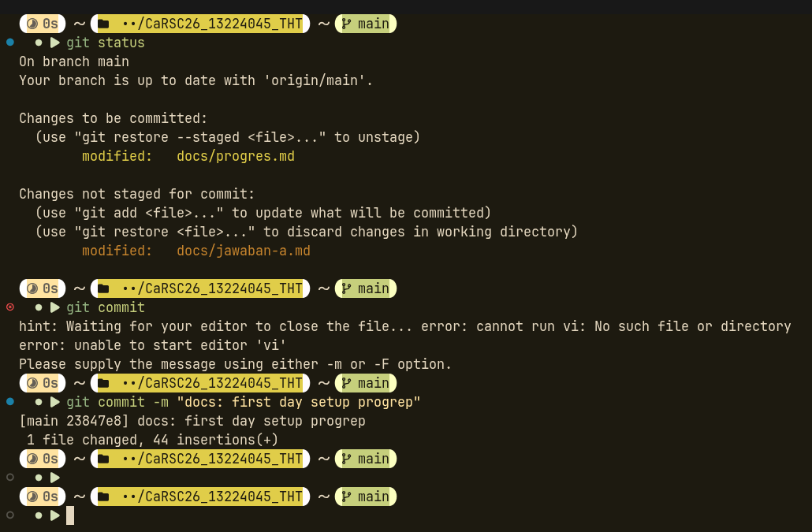

* `git merge <y>`: [[3]](https://www.atlassian.com/git/tutorials/merging-vs-rebasing) creates a new merge commit in x branch from y branch that ties together both histories. 
Example: 

* `git rebase <y> <x>`: [[3]](https://www.atlassian.com/git/tutorials/merging-vs-rebasing) moves new entire/non duplicated commits of x branch on top of commits in y branch, making a linear and much cleaner history in branch x. 
Example: 

* `git log`: show list of commits in current branch's history [[4]](https://education.github.com/git-cheat-sheet-education.pdf). Example: 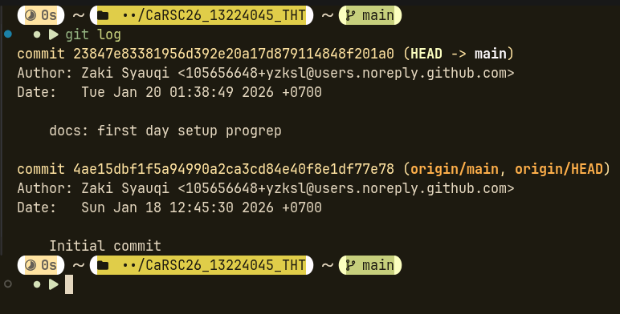

#### Git and VSCode Integration with GitHub
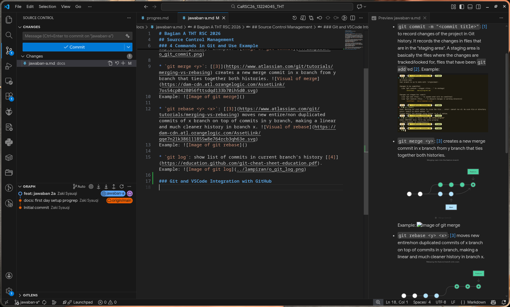

#### LearnGIT
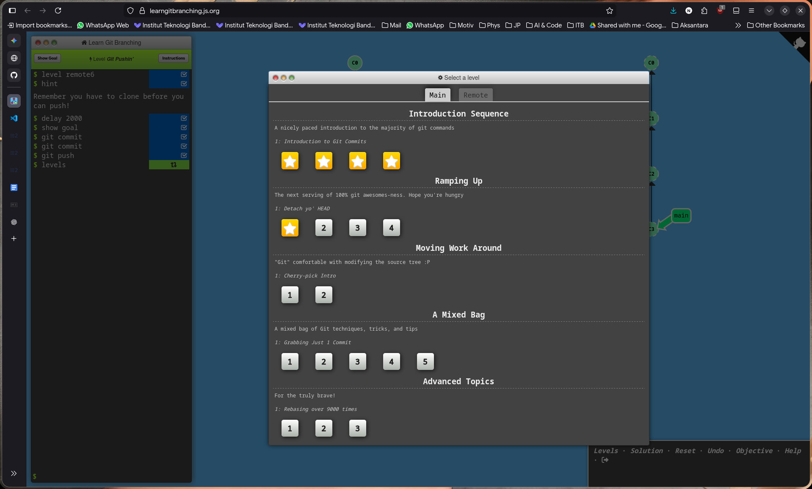
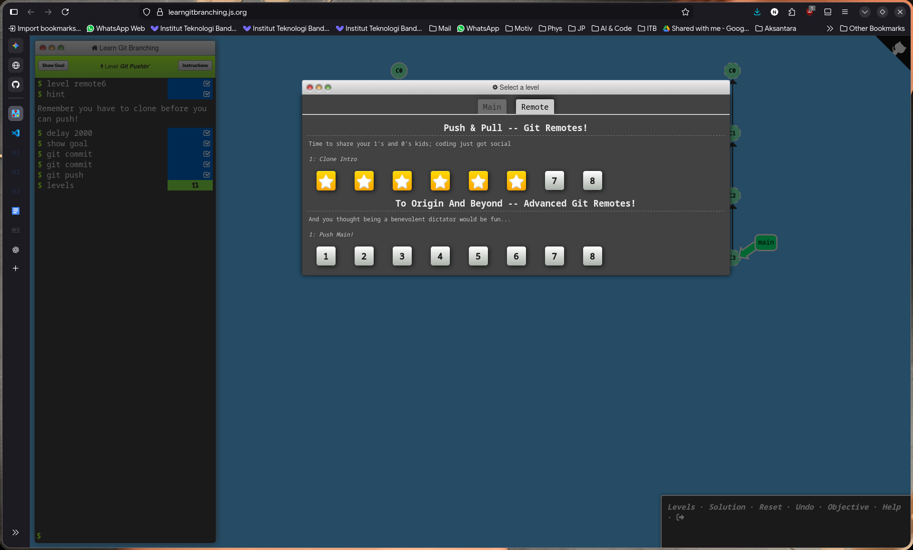

#### Git - GitHub using SSH
SSH is a way to connect securely between computers/services with a pair of keys. One of them is public, can be accessed by any, acts as a lock, while the other is private, acts as a key. [[5]](https://www.w3schools.com/git/git_security_ssh.asp?remote=github) 
SSH public key can be added to a GitHub account, and you can access and modify repositories of that account with Git over SSH without using username and password. [[6]](https://docs.github.com/en/authentication/connecting-to-github-with-ssh/about-ssh)

w3school exercise:
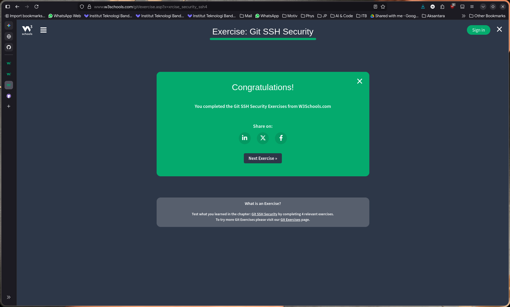


## Ground Control Station

#### Mission Planner Installation
I installed Mission Planner from the ArduPilot website and ran it on Arch Linux using Mono. It worked okay for parameter tuning in 2025 so I'll keep using it for now. 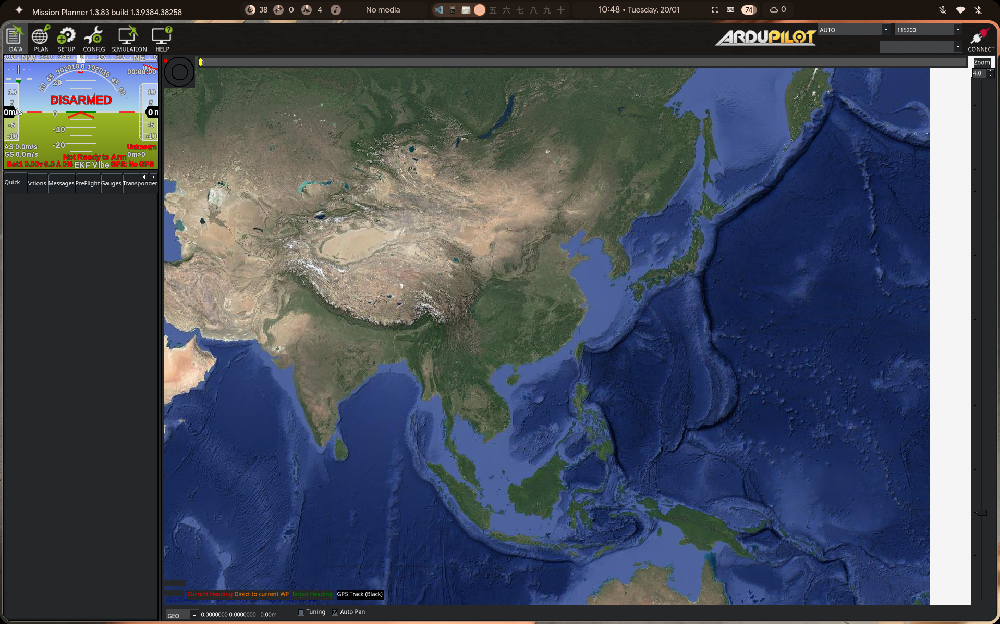

#### Mission Planner Features
Look at the [following](https://docs.google.com/document/d/1BIlF2uRbo29JuuXp26CezTWbTK-1dVvzyV7rmqaYIOU/edit?tab=t.0#heading=h.ee4hchme7c5p) from THT AHC 2025

#### Mission Planner Mission
The mission is specified to survey a field of 80x100m area.  
Waypoints are added based on distance from last waypoint, making a rectangle. Then, a polygon is drawn from the waypoints, and the mission waypoints are auto generated using the Auto WP --> Survey (Grid) [[7]](https://ardupilot.org/copter/docs/common-planning-a-mission-with-waypoints-and-events.html#auto-grid). 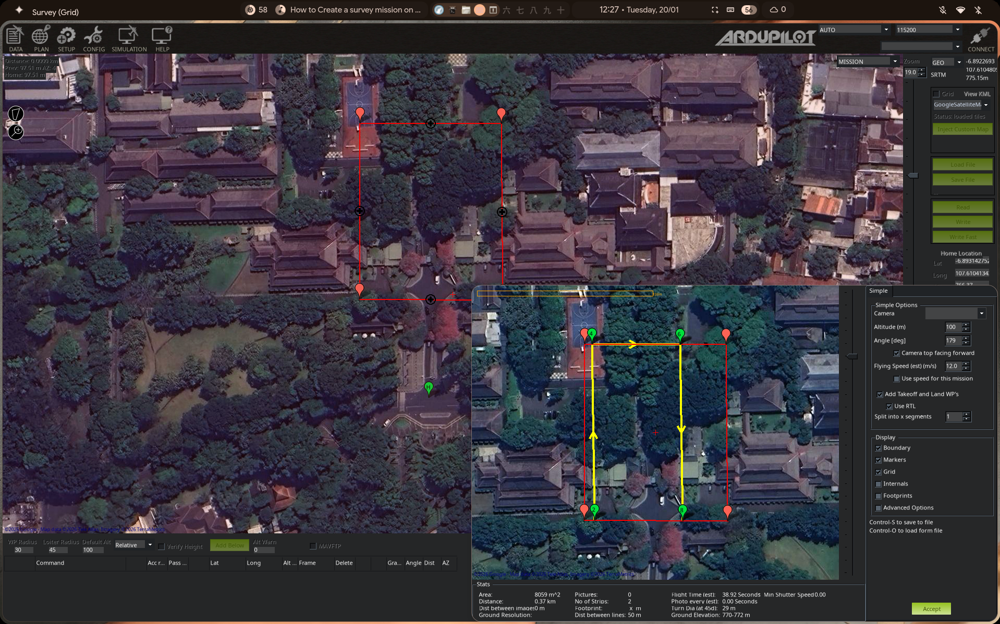  
[Here](../src/a/2/survey_80x100.waypoints) is the waypoint file.


## Development Environment
Ubuntu 22.04 LTS is installed in a distrobox container inside an Arch Linux host. 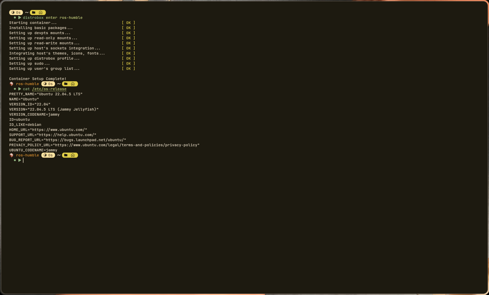

#### Dependency installation
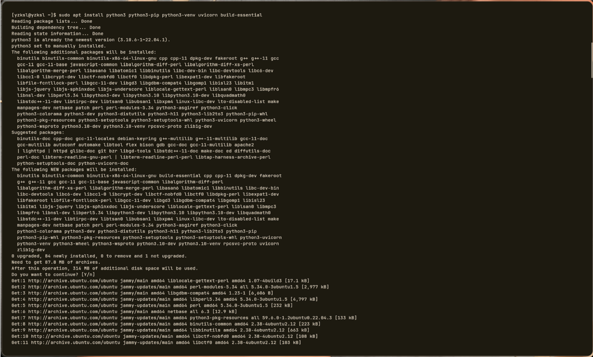  
Lots of log output, and finally the last few outputs are...  
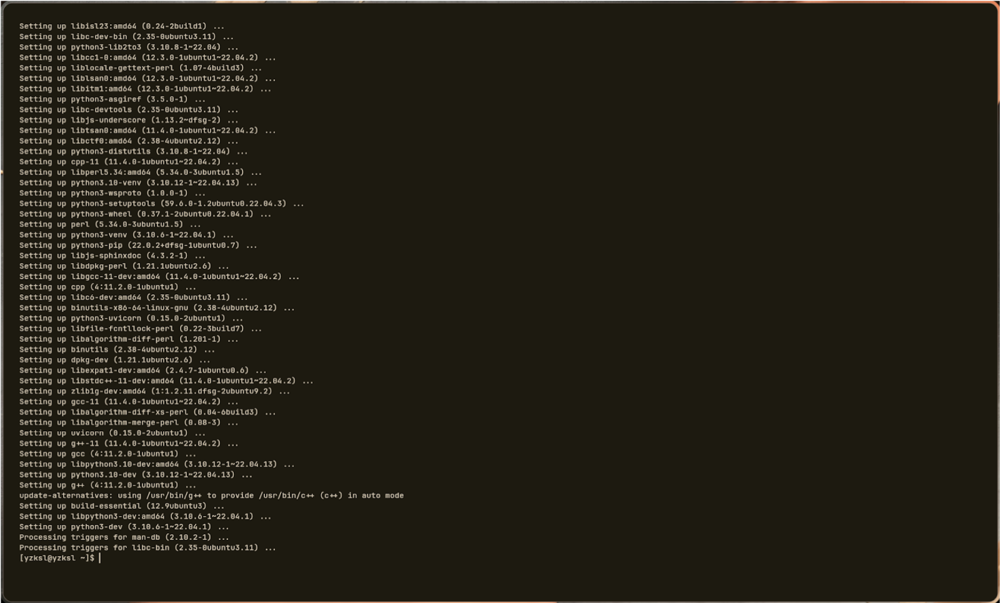

#### ROS2 Humble and Talker-Listener System
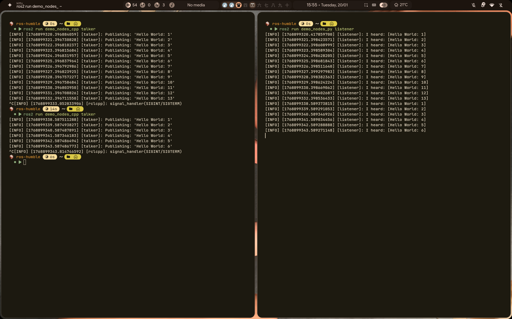

## Basics of UAV
Look at the [following](https://docs.google.com/document/d/1BIlF2uRbo29JuuXp26CezTWbTK-1dVvzyV7rmqaYIOU/) for the answer

## Algorithms

#### A* [[8](https://theory.stanford.edu/~amitp/GameProgramming/), [9](https://www.datacamp.com/tutorial/a-star-algorithm)]
A* is an algorithm used to find the shortest path between two points (guaranteed). It is the most popular choice for pathfinding because it's farly flexible and can be used in a wide range of contexts, such as there being obstacles.  
A* is **a combination of the Dijkstra Algorithm and Greedy Best-First-Search**. As a reminder, Dijkstra's Algorithm finds the shortest path by **examining the closest not-yet-examined vertex**, choosing it, and repeat until it reaches the goal, while the greedy Best-First-Search algorithm works with an **estimate (_heuristic_) of how far from the goal any vertex is**, chooses the vertex closest to the goal, until it reaches the goal. The following is the difference between Dijkstra and Greedy Best-First-Search:  
* Djikstra (no obstacles) 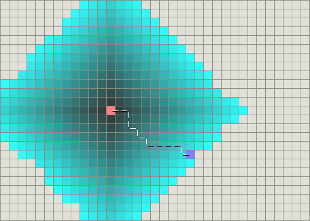
* Djikstra (obstacles) 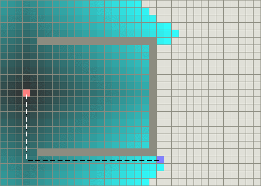
* Best-First-Search (no obstacles) 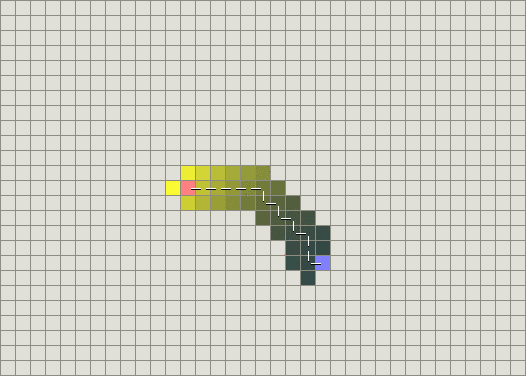
* Best-First-Search (obstacles) 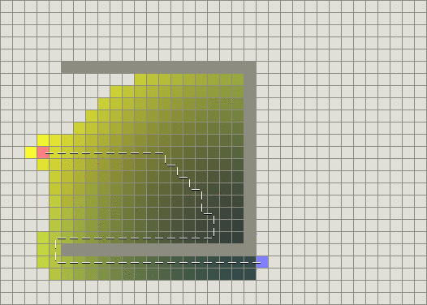

Notice that Dijkstra **fares a lot better on a non-ideal condition but uses a lot of resources, while Best-First-Search is the opposite**. A* aims to get the best of both worlds. 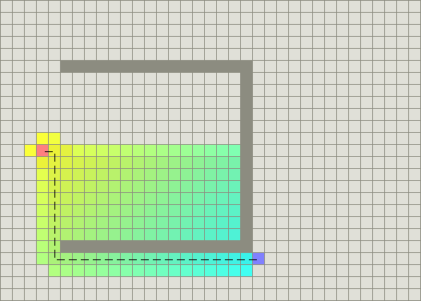

A*'s efficiency comes from its smart cost calculation using three components:
``` 
f(n) = g(n) + h(n)
```
* g(n): exact cost of the path from the starting point to any vertex n
* h(n): heuristic estimated cost of the path from vertex n to the goal

The image above shows the two components, with yellow being high h, teal being high g. Both components guide it to the end point. A* examines the vertex n that has the lowest f(n), chooses it, repeats, until it reaches the goal.

The heuristic function `h(n)` controls A*'s behavior. The lower the h(n) value (and less or equal to the actual cost), the more inefficient but guarantees a shortest path (like Dijkstra's Algorithm), while the higher the h(n) (and more than the actual cost), the more efficient but does not guarantee a shortest path (like Best-First-Search). An ideal heuristic function is an exact one.  
Finding the exact heuristic can be done by computing length of shortest path between every pair of points if possible, or approximating it by doing precomputing with overlaying another "coarse" grid on top of the actual grid and find the shortest path between any pair of points in the "coarse" grid.  
We choose heuristic functions based on the grid and its rules. For example...
* square grid with 4 DoF: use Manhattan Distance  
  `h(n) = D * (|x_1 - x_2| + |y_1 - y_2|)`
* square grid with 8 DoF: use Diagonal Distance
* square grid with any direciton of movement: use Euclidian Distance  
  `h(n) = D * sqrt((x_1 - x_2)^2 + (y_1 - y_2)^2)`
* hexagon grid with 6 DoF: use Manhattan Distance adapted to hexagonal grids.

> [!NOTE]
> Do not use Squared Euclidiean Distance, because it runs into a scaling problem (like, mismatch of unit)

#### D* [[9](https://www.ri.cmu.edu/pub_files/pub3/stentz_anthony__tony__1994_2/stentz_anthony__tony__1994_2.pdf)]
D* is A* but **dynamic**, costs can change in the middle of traversion. When the robot has the layout of the map including the obstacles, but there's actually an obstacle where it is only detected when it gets to a certain point, D* allows the robot to update the shortest path from that point, while A* requires it to re-search. Another difference is that A* plans from start to goal, while D* ancrhors its search at the Goal. Every vertex at the map points to the next vertex that gets it closer to the goal (backpointers).  
In A*, you sort vertices by `f(n) = g(n) + h(n)`, while in D* its sorted by **__k__ values**, the minimum path cost a vertex has has written in a list called OPEN. When a vertex in the minimum path updates and becomes an obstacle (EMPTY (low cost) to OBSTACLE (high cost)), that vertex becomes a RAISE state in the OPEN list, and the vertices that lead to that vertex are also RAISE'd. There will be a vertex and path which leads around the obstacle, doesn't point to the obstacle, which becomes a LOWER state.

#### PID
Check the AHC THT.

#### Kalman Filter
The Kalman Filter is a generic algorithm that **estimates system parameters that are observed or not observed**. It takes inputs that are usually noisy and inaccurate, and output something less noisy and usually more accurate estimates (the state). It can be used for the following:
* Object tracking - uses measured position to estimate position and velocity
* Guidance, navigation, and control - uses IMU sensors to estimate the object's location, velocity, acceleration, I assume attitude, and use them for the next moves

